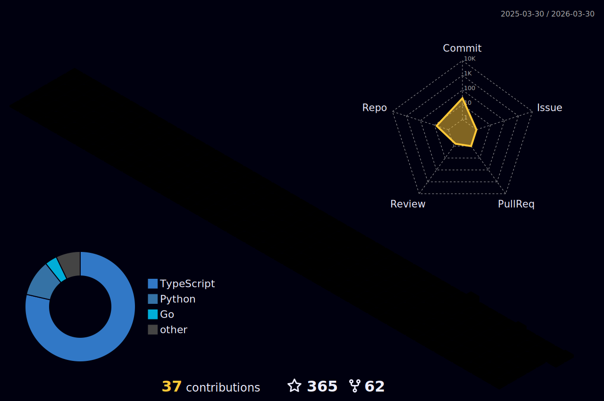

### Hi, I'm Mark Xian 👋

> Talk is cheap. Show me the code.

📍 Guangdong, China | Frontend Developer

---

#### 🔥 Featured Projects

| Project | Description | Stars |
|---------|-------------|-------|
| [MindGeniusAI](https://github.com/xianjianlf2/MindGeniusAI) | Auto generate MindMap with ChatGPT |  |
| [mini-vue](https://github.com/xianjianlf2/mini-vue) | 基于 Vue3 实现最简功能 |  |

#### 🛠 Source Code Learning

| Project | What I Learned |
|---------|---------------|
| [mini-vue](https://github.com/xianjianlf2/mini-vue) | Vue3 reactivity, virtual DOM, compiler |
| [mini-react](https://github.com/xianjianlf2/mini-react) | React fiber, hooks, reconciliation |
| [mini-webpack](https://github.com/xianjianlf2/mini-webpack) | Module bundling, dependency graph |
| [tiny-complier](https://github.com/xianjianlf2/tiny-complier) | Tokenizer, parser, code generation |
| [ts-axios](https://github.com/xianjianlf2/ts-axios) | HTTP client implementation in TypeScript |

#### 💻 Tech Stack

---

  
  

  

