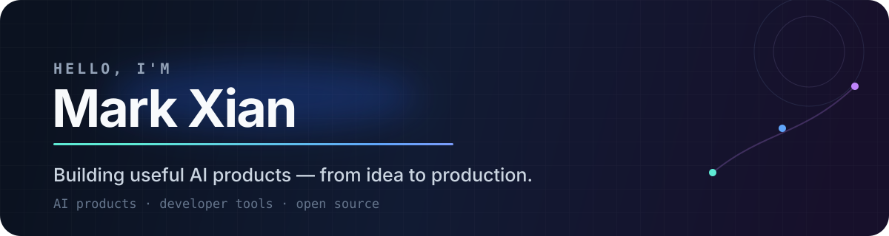

 

## About

I'm an AI product engineer based in Guangdong, China. I make AI feel useful—from agentic interfaces and document intelligence to privacy-first developer tools.

My best work sits where **product taste**, **interaction design**, and **engineering depth** meet: reduce ambiguity, make the interface feel inevitable, and ship the details that make a product hold together.

> **Make AI feel useful.**
>
> Current inquiry: how AI agents can work *with* visual canvases instead of only replying in chat.

## Now building

### [Inkling](https://inkling.markxian.cn/?ref=github-profile) · Agent-native visual thinking

Inkling is an AI mind-mapping canvas. Muse reads your PDFs and draws editable maps live—skeleton first, details grafting in—then sees the nodes you edit by hand and builds on those changes instead of regenerating the whole map.

`React` · `Hono` · `Vercel AI SDK` · `AntV X6`

[Join the private beta →](https://inkling.markxian.cn/?ref=github-profile)

## Selected work

| Project | What it does | Built with |
| :-- | :-- | :-- |
| **[MindGeniusAI](https://github.com/xianjianlf2/MindGeniusAI)**  | A self-hostable AI agent that reads PDFs and draws editable mind maps with visible tool calls, built-in RAG, multi-provider support, and bring-your-own-key privacy. The open-source predecessor to Inkling. | `React` `Hono` `Vercel AI SDK` `RAG` |
| **[flutter-motion-kit](https://github.com/xianjianlf2/flutter-motion-kit)** · [Live ↗](https://motion.markxian.cn/?ref=github-profile) | Previewable Flutter animations with traceable pitfalls, real running web demos, an interactive parameter playground, and remote MCP reuse. | `Astro` `Flutter` `MCP` |
| **[gpt-image-2-tools](https://github.com/xianjianlf2/gpt-image-2-tools)** · [Live ↗](https://image.markxian.cn/?ref=github-profile) | A free, privacy-first, multi-provider image playground for text-to-image, image-to-image, inpainting, and voice control. Your key stays in the browser. | `Astro` `React` `BYOK` |
| **[apidoc2MCP](https://github.com/xianjianlf2/apidoc2MCP)** | Parses OpenAPI, Swagger, Markdown, and HTML API docs, then generates MCP service definitions that AI tools can call directly. | `Python` `TypeScript` `MCP` |

Earlier work: [`vue3-pdf-viewer`](https://github.com/xianjianlf2/vue3-pdf-viewer) / [`@xianjianlf2/vue-pdf-viewer`](https://www.npmjs.com/package/@xianjianlf2/vue-pdf-viewer), an archived PDF.js viewer for Vue 3.

## Open-source activity

I work upstream in the active projects I use—especially agent runtimes, developer tools, and infrastructure. [Browse the live list of open pull requests →](https://github.com/search?q=author%3Axianjianlf2+is%3Apr+is%3Aopen&type=pullrequests)

### In flight

| Project | Current contribution |
| :-- | :-- |
| [AIRI](https://github.com/moeru-ai/airi) | [Restore an off-screen desktop main window](https://github.com/moeru-ai/airi/pull/2203) |
| [Effect](https://github.com/Effect-TS/effect) | [Preserve JSON.rawJSON in cached OpenAPI specs](https://github.com/Effect-TS/effect/pull/7250) |
| [Firecrawl AnyDoc](https://github.com/firecrawl/anydoc) | [Expose slide boundary anchors for presentations](https://github.com/firecrawl/anydoc/pull/95) · [Support standalone HTML documents](https://github.com/firecrawl/anydoc/pull/53) |
| [GitHub Copilot SDK](https://github.com/github/copilot-sdk) | [Support bracketed IPv6 runtime URLs](https://github.com/github/copilot-sdk/pull/2200) · [Expose large output config on custom agents](https://github.com/github/copilot-sdk/pull/2333) |
| [Qwen Code](https://github.com/QwenLM/qwen-code) | [Scope startup warnings to development sessions](https://github.com/QwenLM/qwen-code/pull/8456) · [Report compression API failures distinctly](https://github.com/QwenLM/qwen-code/pull/9119) |
| [TanStack Router](https://github.com/TanStack/router) | [Avoid repeated React Navigate rerenders](https://github.com/TanStack/router/pull/8064) · [Respect `wrapInSuspense` in Solid Router](https://github.com/TanStack/router/pull/7898) |

<b>More active upstream work</b>

 

| Project | Current contribution |
| :-- | :-- |
| [superstruct](https://github.com/ianstormtaylor/superstruct) | [Preserve input coercion when merging structs](https://github.com/ianstormtaylor/superstruct/pull/1300) |
| [stablyai/orca](https://github.com/stablyai/orca) | [Open files in the default app](https://github.com/stablyai/orca/pull/11268) · [Expose task worktree provenance](https://github.com/stablyai/orca/pull/11284) · [Post POSIX agent-hook payloads as JSON](https://github.com/stablyai/orca/pull/11292) |
| [Karabiner-Elements](https://github.com/pqrs-org/Karabiner-Elements) | [Refresh Core Service agent registration on install](https://github.com/pqrs-org/Karabiner-Elements/pull/4529) · [Add default mouse modification setting](https://github.com/pqrs-org/Karabiner-Elements/pull/4530) |
| [browser-use](https://github.com/browser-use/browser-use) | [Return errors for stale click and dropdown actions](https://github.com/browser-use/browser-use/pull/5455) |
| [Kimi Code](https://github.com/MoonshotAI/kimi-code) | [Fix code-workspace path escape errors](https://github.com/MoonshotAI/kimi-code/pull/2283) |
| [Quilt](https://github.com/quiltdata/quilt-rs) | [Show actionable S3 errors in QuiltSync](https://github.com/quiltdata/quilt-rs/pull/861) · [Add reset command for local-only packages](https://github.com/quiltdata/quilt-rs/pull/860) · [Add JSON output for read commands](https://github.com/quiltdata/quilt-rs/pull/851) |
| [TanStack Form](https://github.com/TanStack/form) | [Keep the `reset(values)` baseline on update](https://github.com/TanStack/form/pull/2235) · [Clear stale linked-field validation errors](https://github.com/TanStack/form/pull/2244) |
| [Drizzle ORM](https://github.com/drizzle-team/drizzle-orm) | [Fix relation-name collision with inherited keys](https://github.com/drizzle-team/drizzle-orm/pull/6086) · [Preserve Unicode identifiers in casing helpers](https://github.com/drizzle-team/drizzle-orm/pull/6087) · [Preserve custom codecs for aggregate functions](https://github.com/drizzle-team/drizzle-orm/pull/6088) |
| [fast-check](https://github.com/dubzzz/fast-check) | [Allow sync beforeEach hooks for async properties](https://github.com/dubzzz/fast-check/pull/7191) |
| [sktime](https://github.com/sktime/sktime) | [Replace sklearn grid search with native evaluate](https://github.com/sktime/sktime/pull/10749) |

Curated snapshot checked on 15 Aug 2026; the live GitHub query above is the source of truth.

### Recently merged

| Project | Merged contribution |
| :-- | :-- |
| [Calico](https://github.com/projectcalico/calico) | [Expose server write timeout configuration](https://github.com/projectcalico/calico/pull/13411) · [Re-advertise service external IPs from route reflectors](https://github.com/projectcalico/calico/pull/13413) |
| [AIRI](https://github.com/moeru-ai/airi) | [Add DeepSeek thinking mode toggle](https://github.com/moeru-ai/airi/pull/2280) |
| [Karabiner-Elements](https://github.com/pqrs-org/Karabiner-Elements) | [Add ctrl-click to command-click example](https://github.com/pqrs-org/Karabiner-Elements/pull/4527) · [Add notification window position setting](https://github.com/pqrs-org/Karabiner-Elements/pull/4528) · [Add duration to notification messages](https://github.com/pqrs-org/Karabiner-Elements/pull/4525) |

<b>More recent and earlier merged work</b>

 

| Project | Merged contribution |
| :-- | :-- |
| [Effect](https://github.com/Effect-TS/effect) | [Return fresh cached specs from OpenAPI](https://github.com/Effect-TS/effect/pull/6550) · [Stringify bigint values in JSON diagnostics](https://github.com/Effect-TS/effect/pull/6546) |
| [Firewood](https://github.com/ava-labs/firewood) | [Escape JSON strings in `fwdctl` dumps](https://github.com/ava-labs/firewood/pull/2177) |
| [stablyai/orca](https://github.com/stablyai/orca) | [Open symlink files when stat fails](https://github.com/stablyai/orca/pull/11670) |
| [Dashi Taskboard](https://github.com/chuspeeism/dashi-taskboard) | [Improve dark-mode select contrast](https://github.com/chuspeeism/dashi-taskboard/pull/2) |
| [faker](https://github.com/faker-js/faker) | [Exclude reserved port 0 from `internet.port()`](https://github.com/faker-js/faker/pull/3948) |
| [Quilt](https://github.com/quiltdata/quilt-rs) | [Give `quilt list` a table of bucket, namespace, and status](https://github.com/quiltdata/quilt-rs/pull/846) |
| [MLflow](https://github.com/mlflow/mlflow) | [Hide redundant metric names in chart cards](https://github.com/mlflow/mlflow/pull/23212) |
| [Beanie](https://github.com/BeanieODM/beanie) | [Preserve awaitable types for find-one upsert](https://github.com/BeanieODM/beanie/pull/1346) |
| [Mastra](https://github.com/mastra-ai/mastra) | [Abort A2A streams when tasks are canceled](https://github.com/mastra-ai/mastra/pull/20505) · [Retry empty working-memory extraction](https://github.com/mastra-ai/mastra/pull/20565) |
| [Qwen Code](https://github.com/QwenLM/qwen-code) | [Fail closed on zero-inode file-cache entries](https://github.com/QwenLM/qwen-code/pull/8290) |
| [pnpm](https://github.com/pnpm/pnpm) | [Apply the `publishedBy` cutoff to the held-back update baseline](https://github.com/pnpm/pnpm/pull/13115) |
| [Luxon](https://github.com/moment/luxon) | [Respect endpoint zones in `hasSame` for empty intervals](https://github.com/moment/luxon/pull/1790) |
| [Calico](https://github.com/projectcalico/calico) | [Sanitize chart-version labels](https://github.com/projectcalico/calico/pull/13412) |
| [Kaneo](https://github.com/usekaneo/kaneo) | [Avoid per-task kanban metadata requests](https://github.com/usekaneo/kaneo/pull/1475) |
| [GitHub Copilot SDK](https://github.com/github/copilot-sdk) | [Clarify working-directory defaults across SDKs](https://github.com/github/copilot-sdk/pull/2201) |
| [memfs](https://github.com/streamich/memfs) | [Embed sources in published sourcemaps](https://github.com/streamich/memfs/pull/1275) · [Remove `tslib` from peer dependencies](https://github.com/streamich/memfs/pull/1269) |
| [stablyai/orca](https://github.com/stablyai/orca) | [Faster startup through overlapping sidebar and worktree loading](https://github.com/stablyai/orca/pull/7306) · [Correct CJK IME behavior when renaming commits](https://github.com/stablyai/orca/pull/7081) |
| [FlowiseAI/Flowise](https://github.com/FlowiseAI/Flowise) | [Improved the Add Nodes interaction](https://github.com/FlowiseAI/Flowise/pull/162) |
| [apitable/apitable](https://github.com/apitable/apitable) | [Improved Simplified Chinese localization](https://github.com/apitable/apitable/pull/367) |
| [Navideck/universal_ble](https://github.com/Navideck/universal_ble) | [Fixed Dart primary-constructor compatibility](https://github.com/Navideck/universal_ble/pull/249) |
| [crxjs/chrome-extension-tools](https://github.com/crxjs/chrome-extension-tools) | [Added Vue use-case documentation](https://github.com/crxjs/chrome-extension-tools/pull/870) |
| [luckysmg/flutter_swipe_action_cell](https://github.com/luckysmg/flutter_swipe_action_cell) | [Added the `hasAnyOpenCell` query API](https://github.com/luckysmg/flutter_swipe_action_cell/pull/84) · [Fixed clipped elevation shadows](https://github.com/luckysmg/flutter_swipe_action_cell/pull/85) |
| [fastclaw-ai/weclaw](https://github.com/fastclaw-ai/weclaw) | [Detected agents installed through nvm and mise](https://github.com/fastclaw-ai/weclaw/pull/11) |
| [cuixueshe/dida](https://github.com/cuixueshe/dida) | 5 merged PRs across draggable navigation, project CRUD, and bug fixes |

## Learning in public

I rebuild familiar tools—and now agent runtimes—from scratch to understand the decisions beneath their APIs. Each project develops one system incrementally, commit by commit.

### [super-agent](https://github.com/xianjianlf2/super-agent) · Tool-using agents, chapter by chapter

A branch-by-branch study of streaming, tool calling, MCP clients, deferred tool loading, session persistence, and context compaction.

`TypeScript` · `Vercel AI SDK v6` · `Qwen` · `MCP`

<b>Explore the 6-project mini-* source-code series</b>

 

| Project | Systems explored |
| :-- | :-- |
| [mini-vue](https://github.com/xianjianlf2/mini-vue) | Reactivity, virtual DOM diffing, template compilation, lifecycle hooks |
| [mini-koa](https://github.com/xianjianlf2/mini-koa) | Middleware composition, onion model, context, router layering |
| [mini-react](https://github.com/xianjianlf2/mini-react) | Fiber, reconciliation, `useState`, `useEffect` |
| [mini-webpack](https://github.com/xianjianlf2/mini-webpack) | Module bundling, dependency graphs, loaders, plugins |
| [mini-compiler](https://github.com/xianjianlf2/mini-compiler) | Tokenization, parsing, AST traversal, code generation |
| [ts-axios](https://github.com/xianjianlf2/ts-axios) | Interceptors, config merging, data transforms, cancellation, and other HTTP-client internals |

## Toolbox

  
  
  
  
  
  
  
  
  
  

 

**Have an interesting product idea or open-source problem?** 
[See what I've shipped](https://markxian.cn/?ref=github-profile) · [GitHub activity](https://github.com/xianjianlf2?tab=activity) · [Juejin](https://juejin.cn/user/4495219058030952) · [Say hello](mailto:mark-xian@foxmail.com)

<!-- Invisible profile-view counter; renders as nothing. -->

