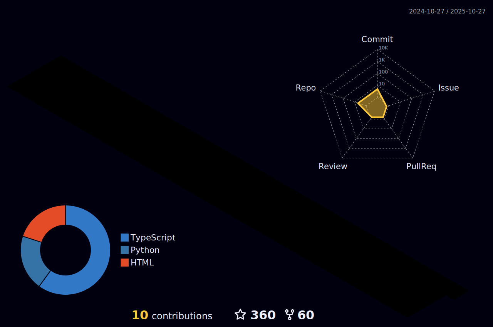

**Mark Xian**

|                             项目                             |               简述                |                             技术                             |
| :----------------------------------------------------------: | :-------------------------------: | :----------------------------------------------------------: |
|     [mini-vue](https://github.com/xianjianlf2/mini-vue)      |          最简实现`vue3`           | <code></code> |
| [mini-webpack](https://github.com/xianjianlf2/mini-webpack)  |        实现简易版`webpack`        | <code></code> |

          
Technology Stack：

<code></code><code></code><code></code><code></code><code></code>

